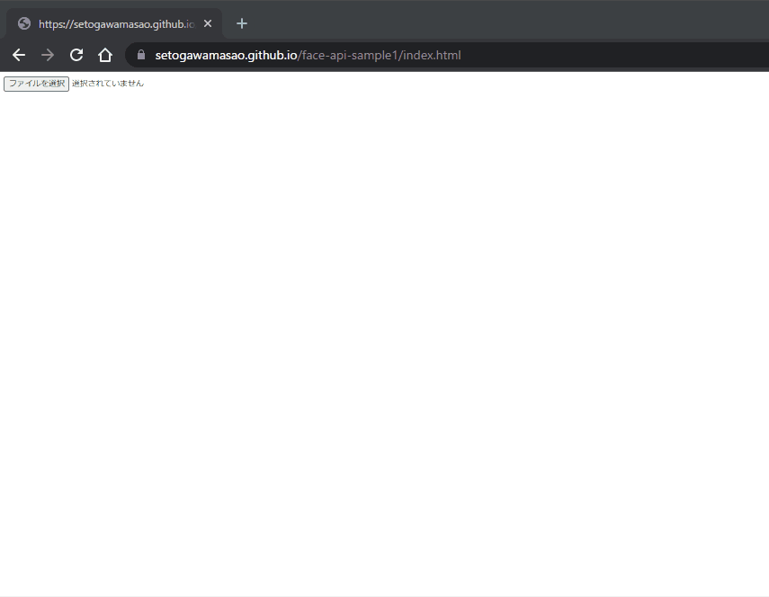

# face-api.js の最小サンプル

## デモサイト

https://setogawamasao.github.io/face-api-sample1/index.html

## 起動方法

- git clone https://github.com/setogawamasao/face-api-sample1.git .

- npm install

- nodemon server.js

- http://localhost:3000 へアクセス

## 使い方

- 任意の画像をアップロードすると、顔を認識する
